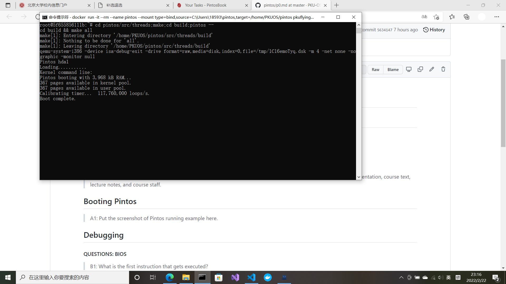
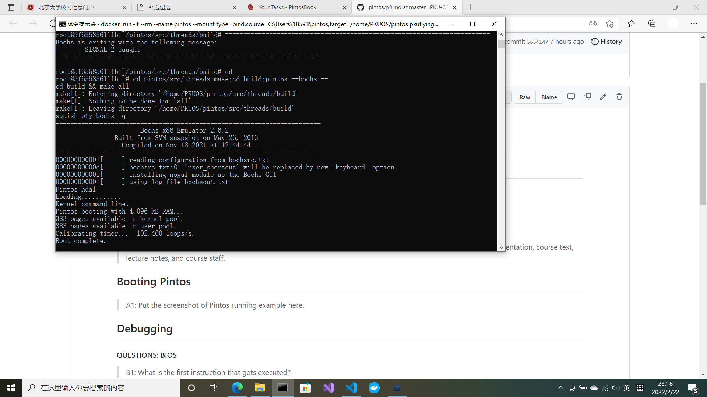
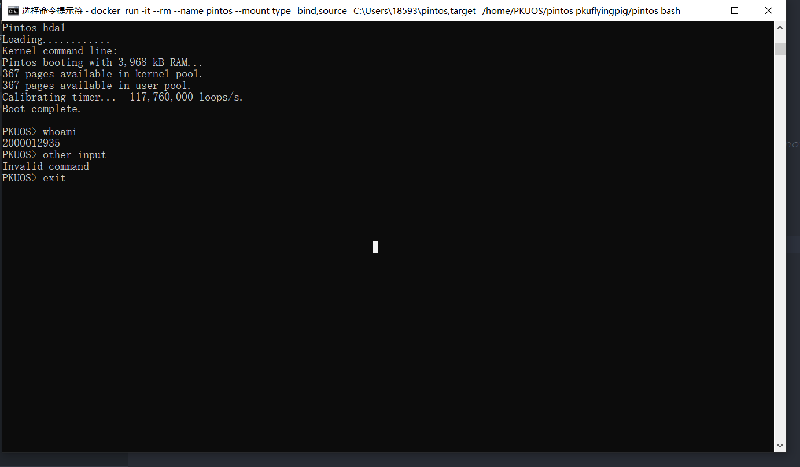

# Project 0: Getting Real

## Preliminaries

>Fill in your name and email address.

Jin Yang <2000012935@stu.pku.edu.cn>

>If you have any preliminary comments on your submission, notes for the TAs, please give them here.

>Please cite any offline or online sources you consulted while preparing your submission, other than the Pintos documentation, course text, lecture notes, and course staff.

## Booting Pintos

>A1: Put the screenshot of Pintos running example here.

## Debugging

#### QUESTIONS: BIOS 

>B1: What is the first instruction that gets executed?  
    
    ljmp   $0xf000,$0xe05b

>B2: At which physical address is this instruction located?  
    
    0xfffffff0

#### QUESTIONS: BOOTLOADER

>B3: How does the bootloader read disk sectors? In particular, what BIOS interrupt is used? 

Firstly,call **read_mbr** to find the partitioned hard disk, in the disk,use **check_partition** to find the matched partition, in the partition, call **read_sector** to read the sector;***int $0x13*** is used when reading sector.

>B4: How does the bootloader decide whether it successfully finds the Pintos kernel?

Check the address **%es:(%si)** and **%es:4(%si)**, if **%es:4(%si)** is **0x20**, the kernel is found and if **%es:(%si)** is **0x80**, it is bootable.

>B5: What happens when the bootloader could not find the Pintos kernel?

It prints *"Not found"* and calls an interrupt ***int $0x18***

>B6: At what point and how exactly does the bootloader transfer control to the Pintos kernel?

After reading all the sectors of the kernel, it sets the start address(0x20000) and uses a **ljmp** instruction to transfer control to the kernel 

#### QUESTIONS: KERNEL

>B7: At the entry of pintos_init(), what is the value of expression `init_page_dir[pd_no(ptov(0))]` in hexadecimal format? 

    0x0

>B8: When `palloc_get_page()` is called for the first time,

>> B8.1 what does the call stack look like?
>>#0  palloc_get_page (flags=(PAL_ASSERT | PAL_ZERO)) at ../../threads/palloc.c:113
    #1  0xc00203aa in paging_init () at ../../threads/init.c:168
    #2  0xc002031b in pintos_init () at ../../threads/init.c:100
    #3  0xc002013d in start () at ../../threads/start.S:180
>> 

>> B8.2 what is the return value in hexadecimal format? 
>> 
    0xc0101000
>> 

>> B8.3 what is the value of expression `init_page_dir[pd_no(ptov(0))]` in hexadecimal format?
>>
    0x0
>> 

>B9: When palloc_get_page() is called for the third time,

>> B9.1 what does the call stack look like?
>>#0  palloc_get_page (flags=PAL_ZERO) at ../../threads/palloc.c:113
    #1  0xc0020a81 in thread_create (name=0xc002e895 "idle", priority=0, function=0xc0020eb0 <idle>, aux=0xc000efbc) at ../../threads/thread.c:178
    #2  0xc0020976 in thread_start () at ../../threads/thread.c:111
    #3  0xc0020334 in pintos_init () at ../../threads/init.c:119
    #4  0xc002013d in start () at ../../threads/start.S:180
>> 

>> B9.2 what is the return value in hexadecimal format?
>>
    0xc0103000
>> 

>> B9.3 what is the value of expression `init_page_dir[pd_no(ptov(0))]` in hexadecimal format?
>>
    0x102027
>> 

## Kernel Monitor

>C1: Put the screenshot of your kernel monitor running example here. (It should show how your kernel shell respond to `whoami`, `exit`, and `other input`.)

#### 

>C2: Explain how you read and write to the console for the kernel monitor. 

Use **input_getc()** to read the command, and store the command in a string ***cmd*** at the same time, print the command with **putchar()**.For the valid command, use **printf()** to print strings.
