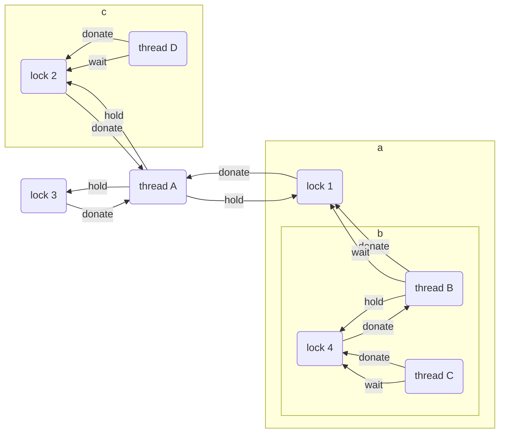

# Project 1: Threads

## Preliminaries

>Fill in your name and email address.

Jin Yang <2000012935@stu.pku.edu.cn>

>If you have any preliminary comments on your submission, notes for the
>TAs, please give them here.

>Please cite any offline or online sources you consulted while
>preparing your submission, other than the Pintos documentation, course
>text, lecture notes, and course staff.  
>books: CSAPP, Modern Operating Systems.  
>webs:Something about linux thread and POSIX thread.  

## Alarm Clock

#### DATA STRUCTURES

>A1: Copy here the declaration of each new or changed struct or struct member, global or static variable, typedef, or enumeration.  Identify the purpose of each in 25 words or less.  

>**THREAD_SLEEPING** in enum thread_status, marks a sleeping thread, the same as **THREAD_BLOCKED**.  
>**wake_time** in struct thread, records the time that sleeping thread awakes.  
>**sleepelem** in struct thread, list element for **sleep_list**.  
>static **sleep_list**, records all the sleeping thread.    

#### ALGORITHMS

>A2: Briefly describe what happens in a call to timer_sleep(),
>including the effects of the timer interrupt handler.  

>**timer_sleep()** calls **thread_sleep()**. **thread_sleep()** changes the **status** to **THREAD_SLEEPING** and set its **wake_time** first. Then inserts the thread into **sleep_list**. Finally calls **schedule()** to switch thread.(Not **thread_yield()** since it changes current thread's status.)  
>There are no changes in **timer_interrupt()**, so it just increases **tick** and calls **thread_tick()**. **thread_tick()** increase current thread's tick and update priority for mlfqs.

>A3: What steps are taken to minimize the amount of time spent in
>the timer interrupt handler?  

>Instead of updating waking time every tick, I call **thread_awake()** in **schedule()** to wake up threads in **sleep_list**. **sleep_list** is ordered to decrease time spent on checking sleeping thread. This may be useful since **timer_interrupt()** has less job to do.

#### SYNCHRONIZATION

>A4: How are race conditions avoided when multiple threads call
>timer_sleep() simultaneously?  

>I disable the interrupts.

>A5: How are race conditions avoided when a timer interrupt occurs
>during a call to timer_sleep()?  

>No interrupts will occur, for I disable all the interrupts.

#### RATIONALE

>A6: Why did you choose this design?  In what ways is it superior to
>another design you considered?  

>I considered to check **sleep_list** every tick, but this costs too much, to reduce cost I use **thread_awake()** in **schedule()**. And at start I use **thread_block()**, to make debug easier I write **thread_sleep()**, which ensures a thread with **THREAD_SLEEPING** status is only from **timer_sleep()**. **sleep_list** is ordered to reduce time spent on checking it.  
>However, this design leads to a problem. A thread falling into a dead loop will never yield cpu since **timer_interrupt()** never calls **thread_yield()**. This is not included in the test, so my design still works.

## Priority Scheduling

#### DATA STRUCTURES

>B1: Copy here the declaration of each new or changed struct or struct member, global or static variable, typedef, or enumeration.  Identify the purpose of each in 25 words or less.  

>**base_priority** in struct thread, records a thread's priority before donated.
>**wait_lock**, lock* in struct thread, records the lock that the thread waits for.
>**hold_lock**, list in struct thread, records all the locks that the thread holds.
>**priority** in struct semaphore, records the semaphore's priority, used for condition variable.
>**elem** in struct lock, list element for **hold_lock** in struct thread.
>**priority** in struct lock, records the max priority from all the threads that wait for this lock.

>B2: Explain the data structure used to track priority donation.
>Use ASCII art to diagram a nested donation.  (Alternately, submit a
>.png file.)  

>I use list to store locks a thread holds, and use pointers to store the lock a thread wait and a lock's holder.

#### ALGORITHMS

>B3: How do you ensure that the highest priority thread waiting for
>a lock, semaphore, or condition variable wakes up first?  

>I use ordered list, change every push_back to insert_ordered as well as use list_min. A thread's priority can be changed, while semaphore's waiter does not update. So I sort list semaphore->waiter in **sema_up()**.

>B4: Describe the sequence of events when a call to lock_acquire()
>causes a priority donation.  How is nested donation handled?  

>It tries to acquire a lock by calling **lock_try_acquire()**. If succeed(which means the lock has no holder), it resets current thread's **wait_lock** to NULL, sets the lock's holder to current thread and its priority to its holder's priority, then insert the lock into its holder's **hold_lock** list. If fail(which means the lock has a holder), it sets current thread's **wait_lock** to the lock and calls **thread_donate_priority()** to donate priority recursively. Then it calls **lock_acquire_succeed()** to finish.  
>In nested donation, **thread_donate_priority()** firstly donates the thread's priority to the lock. Then it calls **thread_update_priority()** to update the lock's holder's priority(thread -> lock.holder). **thread_donate_priority()** recursively donates the thread's priority to the lock, the lock.holder.wait_lock and so on. Also, it updates the priority of the lock.holder, the lock.holder.wait_lock.holder and so on.

>B5: Describe the sequence of events when lock_release() is called
>on a lock that a higher-priority thread is waiting for.  

>It removes the lock from the holder's **hold_lock**, and resets the higher-priority thread's priority to the maximum among the lock's priority it holds and its **base_priority**. Then it resets the lock's holder to NULL and calls **sema_up()**.

#### SYNCHRONIZATION

>B6: Describe a potential race in thread_set_priority() and explain
>how your implementation avoids it.  Can you use a lock to avoid
>this race?  

>**thread_set_priority()** checks whether the current thread(cur) has donor(its **hold_lock**). If this is interrupted, the new thread may donate to 'cur', giving 'cur' a new priority. But **thread_set_priority()** still sets priority of 'cur', while it should not. Wrongly setting the thread's priority may also lead to wrong yield.  
>I only set **base_priority** to new, and set the thread's priority only if the thread's priority is less than the new_priority.  
>The lock is used to protect thread priority. If I use a lock, scheduler cannot get the thread's priority, which means scheduler cannot work. Therefore, using a lock is not suitable.

#### RATIONALE

>B7: Why did you choose this design?  In what ways is it superior to
>another design you considered?  

>I use iterative donation(thread -> lock -> thread), for it is hard to restore priority in direct donation(thread -> thread) and it is hard to code. Locks and semaphores have priority from thread in order to make thread have correct priority.

## Advanced Scheduler

#### DATA STRUCTURES

>C1: Copy here the declaration of each new or changed struct or struct member, global or static variable, typedef, or enumeration.  Identify the purpose of each in 25 words or less.  

>**nice** in struct thread, the nice value of the thread.
>**recent_cpu** in struct thread, recent cpu of the thread.
>static **load_avg**, the average of cpu load.

#### ALGORITHMS

>C2: How is the way you divided the cost of scheduling between code
>inside and outside interrupt context likely to affect performance?  

>A handler with good performance is expected to do only its own job. So updating priority should be finished outside the handler. I put the updating process inside the handler, which can cost a lot. This is hard to avoid, for the priority need to be updated every 4 ticks.

#### RATIONALE

>C3: Briefly critique your design, pointing out advantages and
>disadvantages in your design choices.  If you were to have extra
>time to work on this part of the project, how might you choose to
>refine or improve your design?  

>I only use 1 queue instead of 64 queues, which makes code easier and saves space. However, this spends too much time in scheduling and it's hard to keep the ready_list ordered. If I had more time, I would use 64 ready_list to store threads. 

>C4: The assignment explains arithmetic for fixed-point math in
>detail, but it leaves it open to you to implement it.  Why did you
>decide to implement it the way you did?  If you created an
>abstraction layer for fixed-point math, that is, an abstract data
>type and/or a set of functions or macros to manipulate fixed-point
>numbers, why did you do so?  If not, why not?  

>I write macros in **fix_point.h**, since it's easier and I don't need to change makefile. Fixed-point is made a new type **fp_t**, which is easier to understand. Macros save time and spaces than function calls, while they may lead to weird bugs(I prefer to use operator overload, but I can't). 